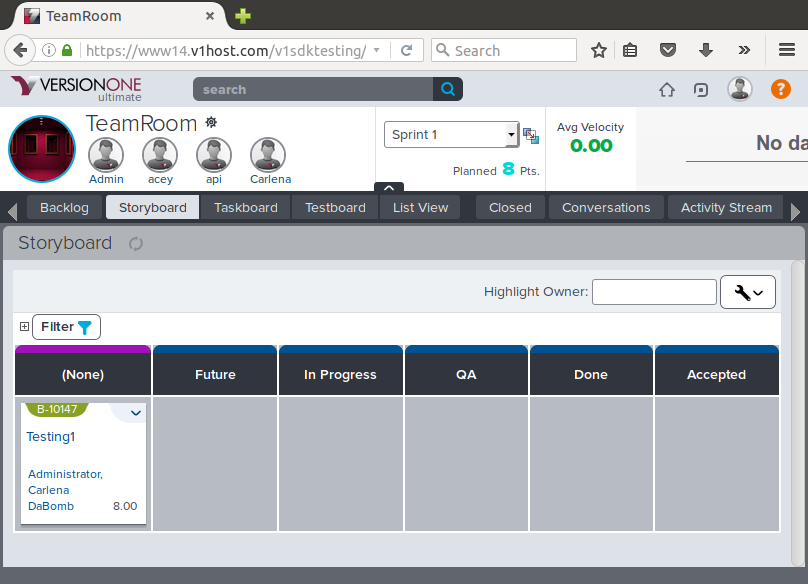
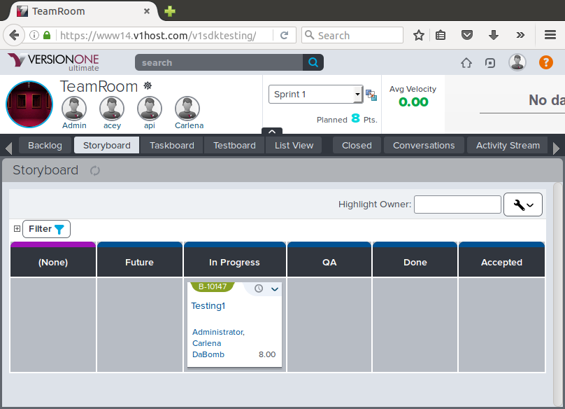
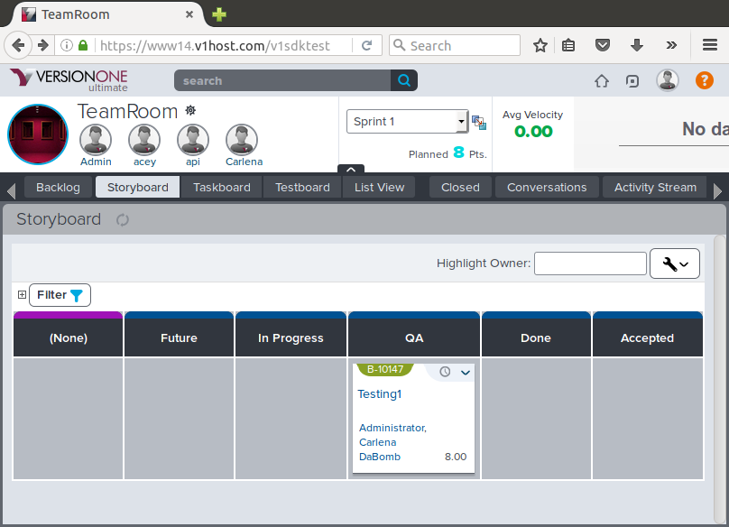

# V1GitTools

VersionOne Git tool integrates VersionOne Story/Defect statuses with git branches and github PRs. The result encourages developers to only make code changes based off of stories and defects promoting better tracking for projects. v1git is roughly based off of git flow, though it should be flexible enough to be used in other workflows.
### Screencast Tutorial
* [Setting up VersionOne Project for V1GitTools](https://malwarebytes.box.com/shared/static/m67wyc7tgctgz2pfdzdl9z20kwl3oudw.mov)
* [V1GitTools Demo & How To Setup](https://malwarebytes.box.com/shared/static/v2arkjgut0e7e3rt04p1mfmkj89p2cqc.mov)

## VersionOne Prerequisites

```v1git``` is designed for an environment where after code is written, testers or QA runs the code and verifies that it meets the requirement. In order for VersionOne to support that flow, an additional story status of "Test" must be created. The following resources are useful for setting up the "Test" status and adding it to the storyboard workflow.

    https://community.versionone.com/Help-Center/Portfolio_Planning/Portfolio_Kanban/Working_with_Portfolio_Kanbans#Changing_Columns
    https://community.versionone.com/Help-Center/Setup_and_Administration/List_Type_Administration


## Installation

### Installing it via Rubygems 

    $ gem install v1gittools

### Or Without Rubygems Install


```
gem install specific_install
gem specific_install https://github.com/Malwarebytes/v1gittools.git master
```


## Setup

Copy ```v1git.conf.example``` to ```~/.v1git.conf```. Please refer to the example file for details on each parameter that needs to be set.

## Usage

Demonstration of workflow:

### Initialize

When you start a new project with v1git, run:

```shell
$ v1git init
NOTICE: v1git has never been used for this project before. Generating default config...

Config generated with the following guessed/assumed values:

Develop branch: develop
github_url: https://github.com/acme/cool_project

github_owner: acme

github_repo: cool_project

If these values are not correct, please correct it in "~/code/cool_project/.git/v1git.conf".

Running validations... (if any of these fail, run 'exec/v1git validate' after correcting the issue.)
Validating VersionOne URL... PASSED
Validating VersionOne credentials... PASSED
Validating git config... PASSED
Validating github endpoint... PASSED
Validating github credentials...PASSED
```

If there are any issues with the setup, please correct and verify all settings are correct.

### Develop

Stories/Defects are created and added to the current sprint. They will be in the "None" column in the TeamRoom Storyboard.



When beginning work on a story/defect, identify the story or defect ID. ```B-10147``` in our example. Run the following command:

```shell
$ v1git develop B-10147 more_widgets # optional branch name; if branch name not included, defaults to story/defect ID

 - Switched to a new branch 'more_widgets' based off of 'develop'.
 - Set B-10147 to the status In Progress.

Implement story/defect in branch (Don't forget to push!). When complete, use:

     v1git qa


```



The story is put into "In Progress" and the git repository is put into a state ready to be worked on.

### QA

After making the necessary commit(s) to satsify the defect/story requirements, v1git can be used to move the story into "Test" status.

```shell
$ v1git qa
 - Created PR for this branch (complete creating PR in browser).
 - Set 'Build' field in story to 'more_widgets'.
 - Set B-10147 to the status QA.
```

A Pull Request dialog box will be opened up for allowing other developers to review the code. QA testers can refer to the 'Build' field in the story to know which branch to refer to when testing the code. The story/defect is moved into the "test" column.




The next steps after this are out of the scope of v1git tool. Testers must verify that the code meets the requirements. Other developers must peer review the Pull Request. Once QA signs off on the story meeting the requirements and the developers have approved and merged the Pull Request, the story can manually moved to "Done".

### Changelog

At the end of the sprint, when the stories/defects are all "Done" and merged into the develop branch, a release branch can be created. This branch can be deployed to a staging area and viewed by the stakeholders or the product owner during the end of sprint demo. When the stories meet the stakeholders/product owner's expectation, the story can be promoted to "Approved".

v1git can generate a changelog of defects and stories that have been merged into the release branch.

```shell
# creating release branch
$ git checkout develop
$ git pull
$ git checkout -b release/1.10.0
$ v1git changelog 1.9.0 release/1.10.0
[No Story ID] - Added logging system. - PR #123
[B-10147] - Testing1 (https://www14.v1host.com/v1sdktesting/story.mvc/Summary?oidToken=Story%3A37879&RoomContext=TeamRoom%3A37878) - PR #124 
```

This changelog can be used in release notes or to distribute to the stakeholders/product owner to quickly see what was implemented and what was not.

Finally, release can be merged into master, a tag can be created and master can be merged back into develop.

```
$ git checkout master
$ git merge --no-ff release/1.10.0
$ git tag -a 1.10.0 # you can place the changelog in the annotations of the tagged version
$ git checkout develop
$ git merge --no-ff master
$ git push --all
```


## Development

After checking out the repo, run `bin/setup` to install dependencies. Then, run `rake spec` to run the tests. You can also run `bin/console` for an interactive prompt that will allow you to experiment.

To install this gem onto your local machine, run `bundle exec rake install`. To release a new version, update the version number in `version.rb`, and then run `bundle exec rake release`, which will create a git tag for the version, push git commits and tags, and push the `.gem` file to [rubygems.org](https://rubygems.org).

## Contributing

Bug reports and pull requests are welcome on GitHub at https://github.com/malwarebytes/v1gittools. This project is intended to be a safe, welcoming space for collaboration, and contributors are expected to adhere to the [Contributor Covenant](http://contributor-covenant.org) code of conduct.


## License

The gem is available as open source under the terms of the [MIT License](http://opensource.org/licenses/MIT).

